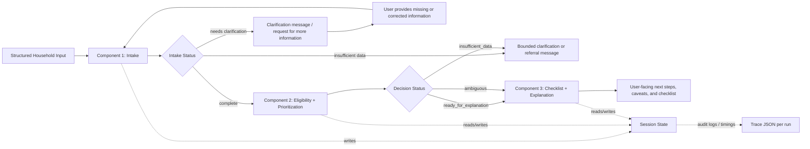

# Phase 2 Submission Packet

## Project status
This repository now supports the core Track A requirement for Phase 2:
- a working prototype of the bounded core flow
- deterministic coordination across three distinct components
- evaluation on 10 synthetic test cases
- per-run traces and structured outputs for auditability

The current flow is:

`intake() -> eligibility_and_prioritization() -> checklist_and_explanation()`

## Architecture diagram

## Role definitions

### Component 1: Intake
- Collects structured household facts.
- Validates missing or contradictory fields.
- Produces a normalized `HouseholdProfile`.
- Stops short of any policy reasoning.

### Component 2: Eligibility + Prioritization
- Applies deterministic prototype rules for SNAP, Medicaid/CHIP, LIHEAP, WIC, and Local Referral.
- Flags ambiguity conservatively when income, household composition, or insurance details block a firm read.
- Ranks programs by likely usefulness, urgency, and application burden.

### Component 3: Checklist + Explanation
- Maps likely programs to document checklists.
- Preserves caveats and uncertainty in plain-language output.
- Produces next-step guidance without presenting an official determination.

## Coordination logic
- The system always starts with Intake.
- In the normal user flow, Intake hands off only when the profile is complete enough to continue.
- If Intake returns `needs clarification`, the system should ask for more information and loop back through Intake rather than moving directly into eligibility reasoning.
- In synthetic evaluation mode, we may intentionally allow some clarification-needing cases to continue so that ambiguity handling can still be tested in downstream components.
- Eligibility + Prioritization always returns structured per-program assessments before any user-facing explanation is generated.
- Checklist + Explanation can only use upstream structured outputs and cannot override decision state.
- The process stops after a bounded user-facing output is generated or when the case is too incomplete for prescreening.

## Tools, memory, and data design
- Tools: local CSV fixtures and deterministic rule tables embedded in the prototype.
- Memory/state: per-run `SessionState` object with component outputs, audit events, and timing data.
- Data:
  - `data/test_cases.csv` for 10 synthetic households
  - `data/expected_results.csv` for expected program statuses and ranking
  - `data/evaluation_results.csv` for actual run outcomes
  - `outputs/traces/*.json` for auditable traces

## Prototype evidence
- Evaluation runner: `python3 -m src.evaluate`
- Automated checks: `python3 -m unittest -q`
- Current result: 10/10 synthetic cases match the expected fixture in `data/expected_results.csv`

## Why this architecture instead of a simpler alternative
- A one-step monolith would blur intake validation, policy reasoning, and user explanation into one opaque stage.
- This three-component split makes failures easier to localize.
- The explanation layer cannot silently smooth over uncertainty because it consumes structured decision output rather than recomputing eligibility itself.
- The smaller architecture is easier to defend than the original five-agent concept while still showing meaningful coordination.

## Risk and governance plan
- The system is explicitly bounded to prescreening and next-step guidance.
- It never claims to submit applications or issue official eligibility determinations.
- Uncertainty is surfaced when income, insurance, or household composition is incomplete or contradictory.
- Local referral output is generic on purpose; it avoids fabricating county-specific claims that were not verified in the prototype.
- Rule drift is a known risk, so the current system should be treated as a dated prototype rather than a live policy tool.

## Contribution update
- Tomas-owned work reflected in the repo:
  - 3-component architecture simplification
  - component/spec design documents
  - orchestration and schema framing
  - synthetic dataset framing and architecture rationale draft
- Yuhan-owned work reflected in the repo:
  - evaluation fixture alignment
  - expected-results grounding
  - prototype implementation completion
  - evaluation runner, traces, walkthrough, and submission packaging

## Remaining work before PDF submission
- Convert this packet into the report format your class expects.
- Add one screenshot or trace excerpt from a representative run.
- Decide whether to keep the current heuristic threshold tables as prototype-only or annotate them with source dates in the final PDF.
